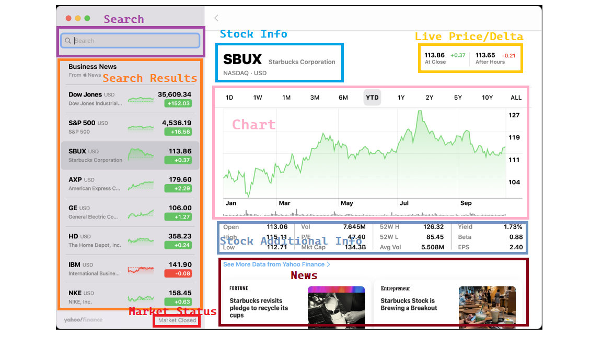
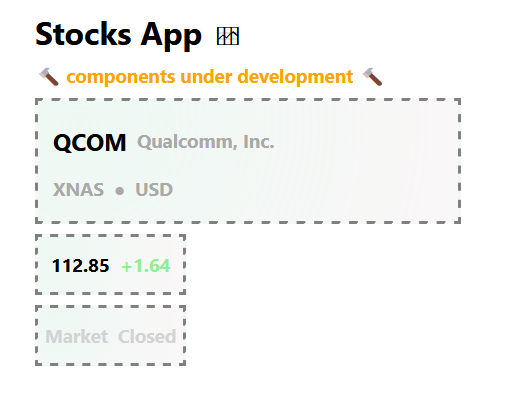

# Stocks Application
> A personal project which aims to create an API-powered Stocks application, based on MacOS [Stocks](https://support.apple.com/en-gb/guide/stocks/welcome/mac).

Project Board:
https://github.com/users/soca-git/projects/1

## Links
- [Create-React-App](https://reactjs.org/docs/create-a-new-react-app.html)
- [React Docs](https://reactjs.org/docs/hello-world.html)
- [react-ttt](https://github.com/soca-git/react-ttt)

---
